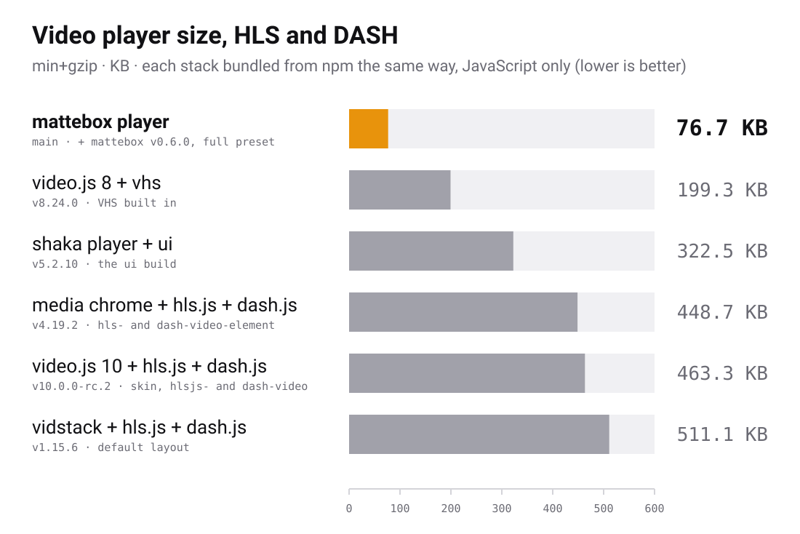

<h1>
  
  Mattebox player
</h1>

[](https://github.com/jboix/mattebox-player/actions/workflows/quality.yml)
[](https://www.npmjs.com/package/@mattebox/player)
[](https://www.npmjs.com/package/@mattebox/player-core)
[](https://www.npmjs.com/package/@mattebox/player-diagnostics)
[](https://www.npmjs.com/package/@mattebox/player-cast)
[](./LICENSE)

The Mattebox player is four packages over the
[mattebox](https://github.com/jboix/mattebox) engine. The engine feeds a
MediaSource and never sets the `src` of the video. The player decides which
handler to use, and adds a custom UI on top of it.

| Package                        | What it is                                                                                                   | Side effects                     |
| ------------------------------ | ------------------------------------------------------------------------------------------------------------ | -------------------------------- |
| `@mattebox/player-core`        | The layer without a UI. It resolves a source and runs the handler chain. About a kilobyte                    | None                             |
| `@mattebox/player`             | The `<mattebox-player>` custom element over the core. No framework                                           | Registers the element on import  |
| `@mattebox/player-diagnostics` | `<mbx-diagnostics>`. The stats, the charts and the browser's support inside the player, and a report to send | Registers the element on import  |
| `@mattebox/player-cast`        | `<mbx-cast-button>` and `<mbx-cast-screen>`. Chromecast from the player, over Google's sender SDK            | Registers the elements on import |

A page with its own UI has two options:

1. Install the core alone and write the UI elements.
2. Install the player and restyle it. Every control has a `part`, and the page styles it with `::part()`.

The engine is a peer dependency of all four packages. The diagnostics and
the cast are optional player elements.

> \[!NOTE]
> The cast is a package of its own because its button loads Google's script
> onto the page whereas AirPlay button uses Safari's own API without extra
> scripts.

<picture>
  <source media="(prefers-color-scheme: dark)" srcset="docs/size-chart-dark.svg">
  
</picture>

The chart bundles every stack from its npm packages in the same way,
JavaScript only. `npm run size-chart` regenerates the chart, and
`--verbose` lists what each row counts.

## Quick start

Install the element and the engine:

```sh
npm install @mattebox/player mattebox --save
```

Import the package once, then write the element on the page. `type` is
optional when the URL has a known extension.

```html
<mattebox-player src="https://example.com/vod/master.m3u8"></mattebox-player>

<script type="module">
  import '@mattebox/player';
</script>
```

The video inside keeps its native API and its native controls, and the
player adds nothing to it.

`controls="custom"` replaces the native controls with elements placed
inside the player: quality, tracks, live, DRM, errors and the rest. Each
one shows only when the engine has its namespace. A control takes its
parameters and its labels as attributes, and its icons as slots.
`controls="none"` hides them all.

A page on a bundler imports the player alone and one entry per control.
Every control has a `part`, and the page styles it with `::part()`.

The core alone plays the same sources without the UI. The handler order is
the page's choice:

```ts
import { createPlayer, matteboxHandler, nativeHandler } from '@mattebox/player-core';
import full from 'mattebox/presets/full';

const player = createPlayer(video, {
  handlers: [matteboxHandler({ preset: full }), nativeHandler()],
});

const session = await player.load({ url: 'https://example.com/vod/master.m3u8' });
session.engine?.quality.pin('720p');
```

The [guide](docs/guide/README.md) explains the rest, starting with
[Getting started](docs/guide/01-getting-started.md).

## Documentation

- [Guide](docs/guide/README.md): how to use the four packages, one chapter per topic.
- [Architecture](docs/architecture.md): the packages, the rules between them, and the handler chain.
- [Demo](https://jboix.github.io/mattebox-player/): every kind of source, with the handler that played it.

## Contributing

Read the [contributing guide](docs/CONTRIBUTING.md) before opening a pull
request. The [Code of Conduct](docs/CODE_OF_CONDUCT.md) applies to everyone
who takes part. Report a vulnerability as [SECURITY.md](docs/SECURITY.md)
describes.

## License

MIT. See [LICENSE](LICENSE).
